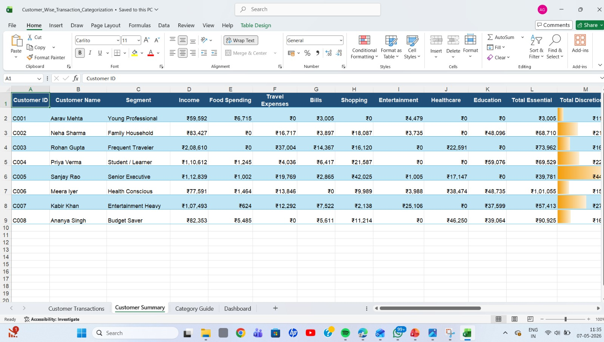

# 📊 Excel Dashboard & Customer Analysis Project

A professional Excel-based analytics project showcasing customer transaction analysis, category insights, and interactive dashboards using Microsoft Excel.

---

## 🚀 Project Overview

This repository contains Excel dashboard screenshots and analysis reports focused on:

- Customer transaction analysis
- Customer summary reports
- Product category insights
- Interactive dashboard visualization

The project demonstrates how Excel can be used for business intelligence, reporting, and data-driven decision-making.

---

## 📁 Project Files

| File Name | Description |
|-----------|-------------|
| `dashboard.jpeg` | Main interactive dashboard visualization |
| `customer_summary.jpeg` | Customer summary analytics |
| `customer_transaction.jpeg` | Customer transaction analysis |
| `category guide.jpeg` | Product/category analysis guide |

---

## 📌 Features

✨ Clean and interactive dashboard design  
📈 Business performance tracking  
👥 Customer behavior analysis  
📊 Category-wise insights  
🎯 Excel data visualization techniques  
📉 KPI and summary reporting  

---

## 🛠️ Tools & Technologies Used

- Microsoft Excel
- Pivot Tables
- Charts & Graphs
- Data Cleaning
- Dashboard Design
- Business Analytics

---

## 📷 Dashboard Preview

### 📊 Main Dashboard

---

### 👥 Customer Summary

---

### 💳 Customer Transactions

---

### 📂 Category Guide

---

## 🎯 Objectives

- Analyze customer purchasing behavior
- Generate business insights from transaction data
- Build visually appealing dashboards
- Improve reporting and decision-making process

---

## 📚 Learning Outcomes

Through this project, you can learn:

- Excel dashboard creation
- Data visualization best practices
- Pivot table analysis
- KPI reporting
- Business analytics workflows

---

## 🌟 Future Improvements

- Add slicers and filters
- Automate reports using VBA
- Connect with Power BI
- Add real-time data integration

---

## 🤝 Contributing

Contributions, suggestions, and improvements are welcome!

Feel free to fork this repository and submit a pull request.

---

## 📬 Contact

**Author:** Deeksha Bawa  

For feedback or collaboration, feel free to connect.

---

## ⭐ Support

If you found this project helpful, give it a ⭐ on GitHub!

---
